# All-about-batteries
Here you will find everything about batteries

# 18650 Battery Usage and Recommendations

This document provides essential information for the safe handling, installation, and selection of 18650 lithium-ion batteries. It includes details on battery dimensions, installation procedures, and recommended models with their specifications.

## 1. Battery Dimensions

18650 batteries typically have the following dimensions:
* **Diameter:** `18mm`
* **Length:** `65mm`

## 2. How to Insert the Battery

Follow these steps carefully to insert the battery:

### ➤ Step 1: Determine Polarity
Identify the positive (`+`) and negative (`-`) poles of the contact pads.

### ➤ Step 2: Inspect the Battery for Damage
Before installation, visually inspect the battery for any signs of damage.  
**Contraindications for use:**
* Presence of dents on the battery body.
* Damage to the insulation, especially near the positive pad.

### ➤ Step 3: Install the Battery
Install the battery into the holder, ensuring you observe the correct polarity (`+` into `+`, `-` into `-`).

## 3. Recommended Battery Models

The following table lists recommended 18650 battery models with their typical current and capacity specifications.

| Manufacturer | Model         | Current (A) | Capacity (mAh) |
| :----------- | :------------ | :---------- | :------------- |
| Molicel      | INR18650-P28A | `35`        | `2800`         |
| Molicel      | INR18650-P26A | `35`        | `2600`         |
| Murata       | VTC5D         | `35`        | `2800`         |
| Murata       | VTC5A         | `30-35`     | `2500`         |
| Samsung      | INR18650-25S  | `25-35`     | `2500`         |
| Samsung      | INR18650-20S  | `30`        | `2000`         |
| Murata       | VTC6          | `30`        | `2100`         |
| Murata       | VTC5          | `20-30`     | `2600`         |
| Sanyo        | UR18650NSX    | `20`        | `2500`         |
| Samsung      | INR18650HG2   | `20`        | `3000`         |
| Samsung      | INR18650HJ2   | `20`        | `3000`         |
| Samsung      | INR18650HE4   | `20`        | `2500`         |
| Samsung      | INR18650-25R  | `20`        | `2500`         |

## 4. Battery Specifications and Purchase Guidelines

### Size
* Flat-top batteries are recommended, but not strictly required.
* Ensure the battery is **exactly `65 mm` long**. Some batteries may be `2-3 mm` longer, which will prevent them from fitting into the holders.

### Characteristics
* **Voltage:** `3.7 Volts`
* **Current:** The rated current must be **not less than `15 Amperes`**. This parameter is the most crucial for performance and safety. Avoid buying batteries designed for flashlights, especially if the current rating is not explicitly indicated on the packaging.
* **Recommended Capacity:** `2500-3800 mAh`.  
  Be cautious: if you see capacities advertised as `4000-9000 mAh`, consider that this is likely a fake capacity.
  
## Where to Buy the Battery

You can purchase these batteries at most local hobby shops (recommended for warranty and assistance) or online from the following links:
Example of a store: [18650batterystore](https://www.18650batterystore.com/)

* [LCLEBM 18650 3400mAh Battery – Amazon](https://www.amazon.com/LCLEBM-3400mAh-Battery-Spotlight-Flashlight/dp/B08H1NZLY7/)
* [SOOCOOL 18650 25RS 2500mAh Battery – Amazon](https://www.amazon.com/SOOCOOL-Authentic-25RS-2500mAh-Rechargeable/dp/B0BNLQ4X8S/)

# How to Check the Charge of an 18650 Battery

This guide explains how to accurately check the charge level of an 18650 lithium-ion battery using a multimeter. Some chargers may show an approximate charge level, but using a multimeter provides more reliable and precise results.

## 1. What You’ll Need

To check the battery charge, prepare the following:

* **A digital multimeter**
* The 18650 battery (installed or removed)

  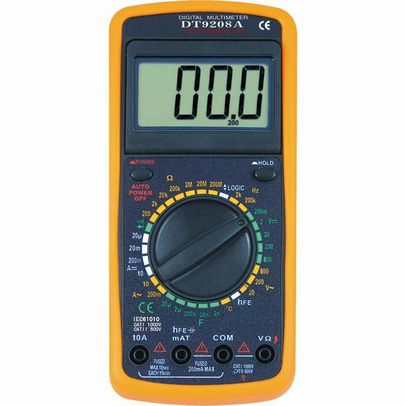

## 2. Measurement Settings

Set your multimeter to **DC voltage measurement mode**, usually labeled as:

* **`20V` range** (This allows you to measure voltages from `0V` to `20V` with two digits after the decimal point.)

## 3. How to Measure

Follow these steps:

### ➤ Step 1: Connect the Probes

* Place the **red probe** to the battery's **positive terminal**.
* Place the **black probe** to the battery's **negative terminal**.
* It does not matter if the screen shows a negative value — the **absolute voltage** number is what matters.

### ➤ Step 2: Read the Display

Interpret the voltage according to the table below:

| Voltage Range | Battery State            |
| :------------ | :------------------------ |
| `3.9V – 4.3V` | Fully charged             |
| `3.4V – 3.8V` | Partially charged         |
| `< 3.4V`      | Discharged                |
| `< 2.5V`      | Deep discharge (replace)  |

>  **Warning:** If the voltage is **below `2.5V`**, the battery is in **deep discharge mode** and should be **replaced** to avoid performance issues or safety risks.

 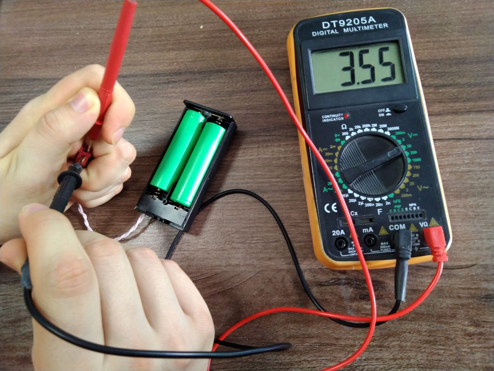

The photo shows batteries that will soon need to be charged

# How to Charge 18650 Batteries with Imax B6 Charger or Similar?

This guide provides instructions for safely charging 18650 lithium-ion batteries using an Imax B6 charger or similar models. You can charge batteries without removing them from their battery boxes. Before starting, ensure all battery boxes are completely filled with batteries.

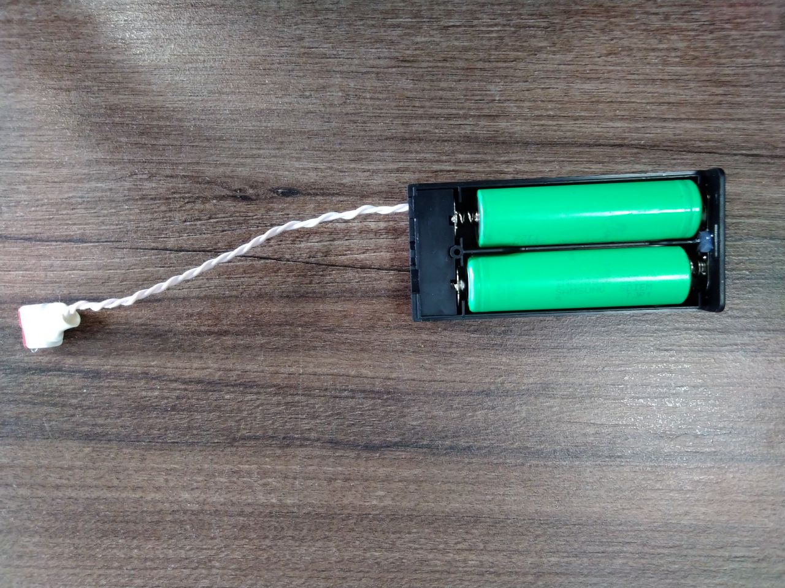

The Imax B6 charger supports two primary charging methods:

* Using a conventional splitter

  
* Using a balancing cable
  
You will find the necessary types of cables in the repair kit and in the box with your Imax B6 charger.

## ➤ Step 1: Charging Batteries with a Conventional Splitter

A typical splitter cable can accommodate a varying number of connected battery boxes.

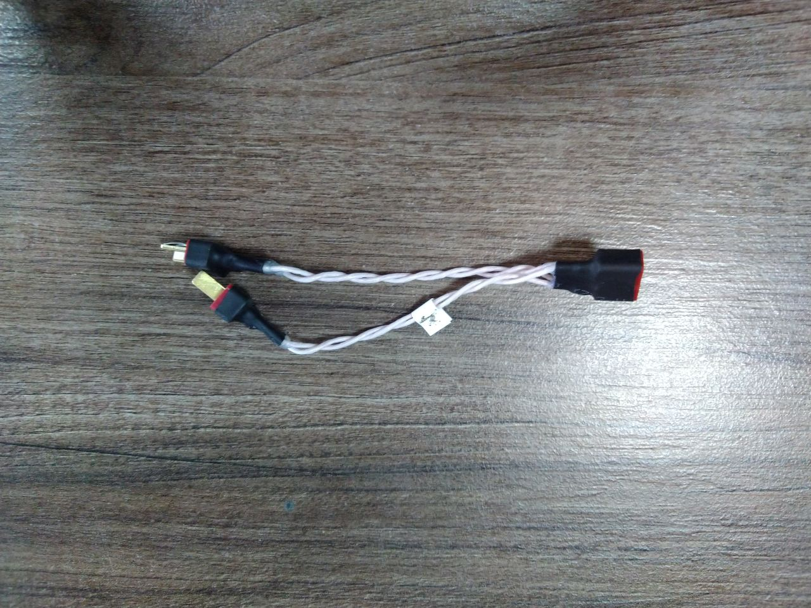

###  1.1. Connecting the Battery Boxes

Connect the battery boxes into the designated connector on the splitter.

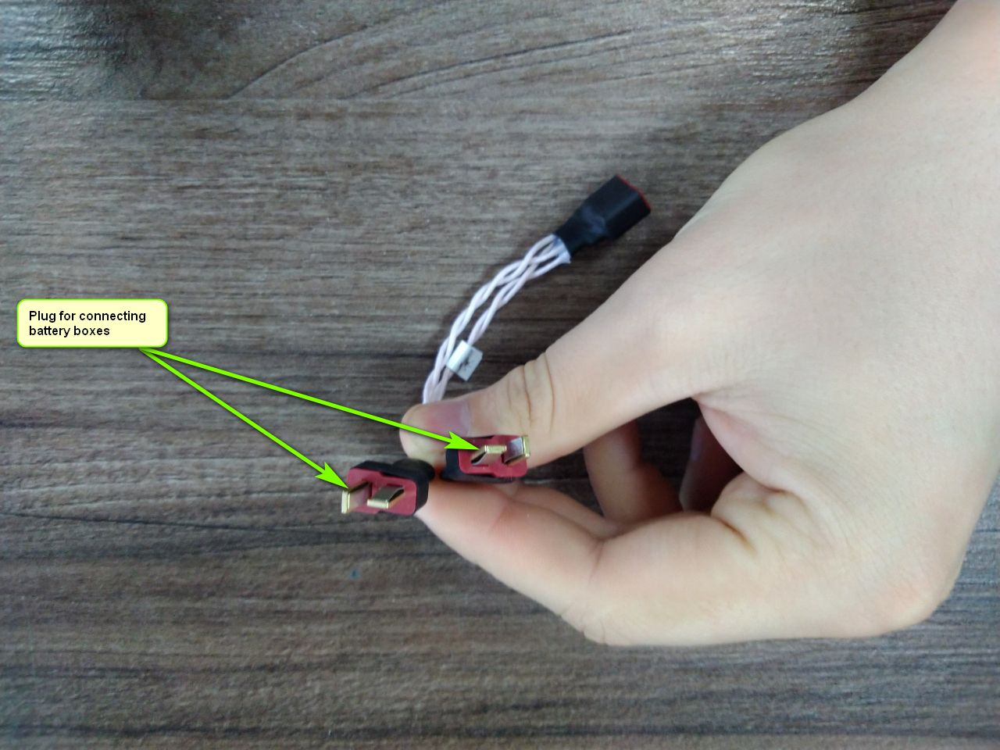

### 1.2. Connecting to the Charger

Connect the charger plug to the Imax B6.

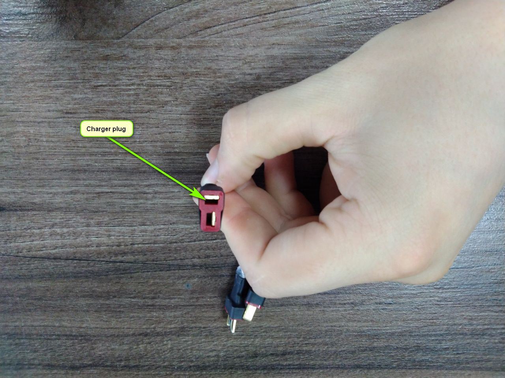

After connecting the boxes, it will look like this:

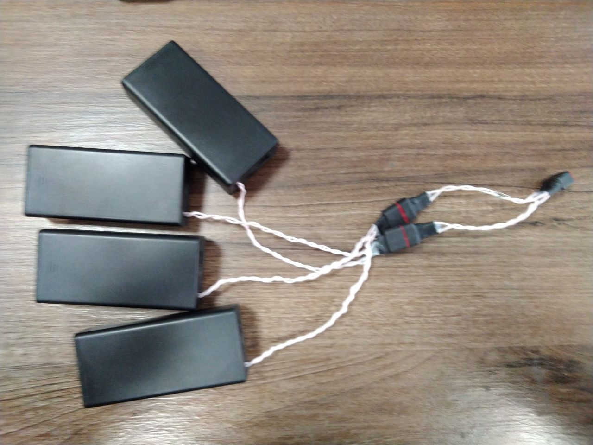

**Attention!** Battery boxes with multiple outputs (connectors) must be connected to only one connector of the charging cable when charging!

### 1.3. Setting Imax B6 Parameters

Before starting charging, you need to set the Imax B6 settings, taking into account the number of rechargeable batteries. This can be done using the control buttons on the charger.

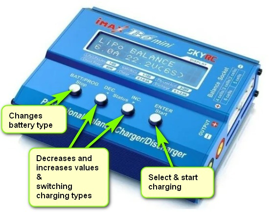

* **Current:** For one battery, the required current is 1.5A. Do not exceed 6.0A when charging more than 4 batteries.
* **Voltage:** The voltage must be set to 3.7V (1S).
* **Mode:** Select the LiPo CHARGE mode.

### 1.4. Starting the Charging Process

After setting the desired parameters, long-press the Start button. The iMax will then check the batteries for defects. If it does not emit any signals, the text on the screen will change and request that the Start button be pressed again. After confirming, the batteries will start charging.

For an example of Imax settings for charging 4 batteries, see the video below:

[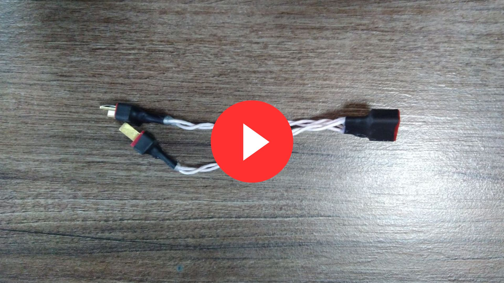](https://youtu.be/8Pjf7a8LbhY)

## ➤ Step 2: Charging Batteries with a Balancing Cable

The balance cable looks like this:

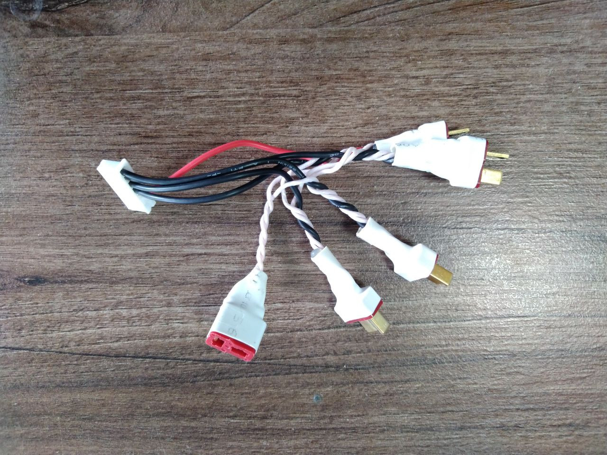

The main difference from a conventional cable is that all cable outlets must be connected.

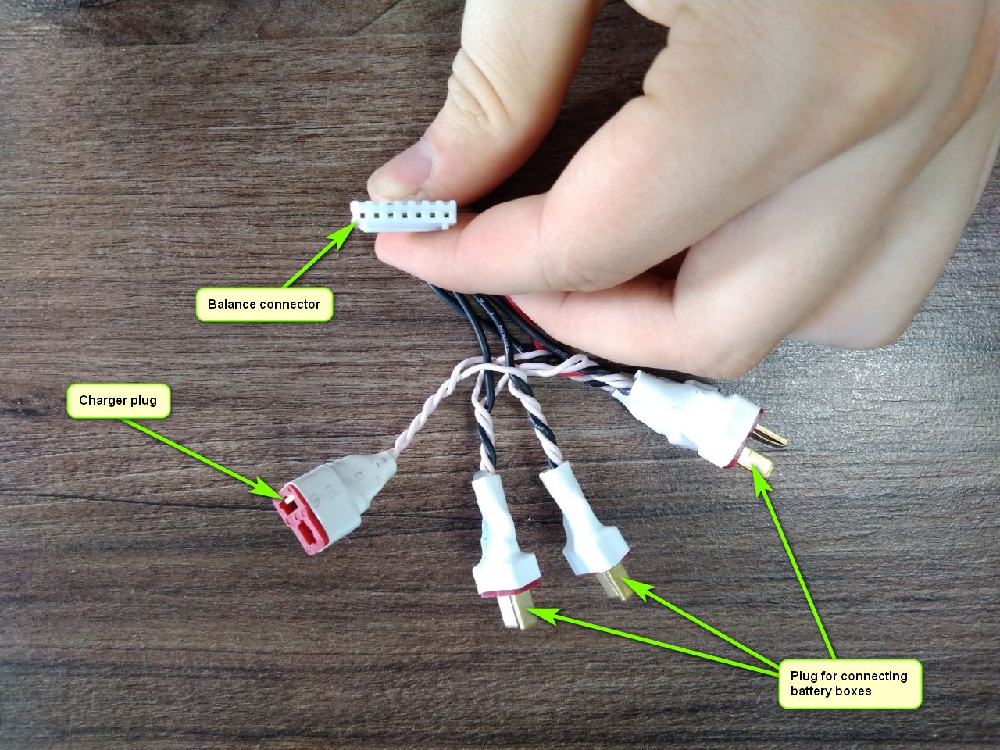

### 2.1. Connecting the Balancing Connector

The balancing connector must be connected to the required connector on Imax.

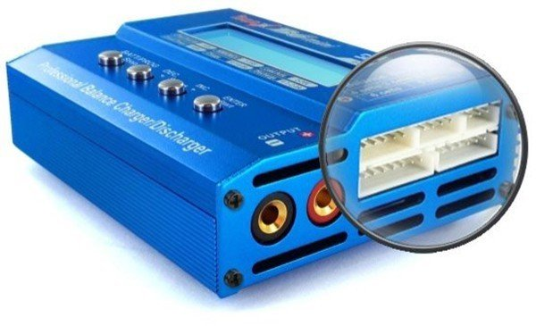

Connected battery boxes to Imax via a balancing cable will look like this:

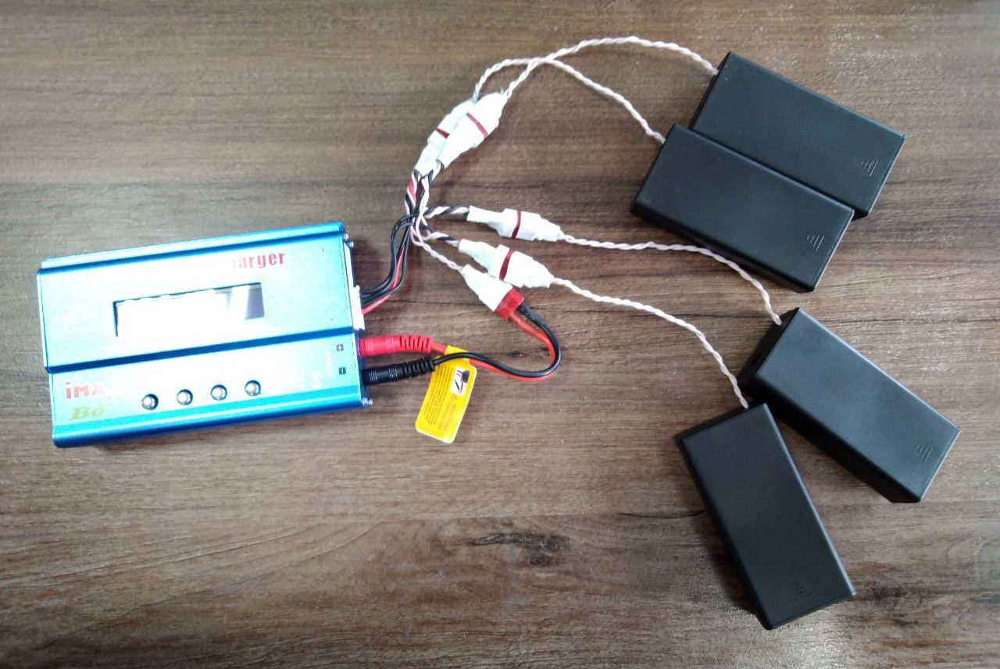

**Attention!** Battery boxes with multiple outputs (connectors) must be connected to only one connector of the charging cable when charging!

### 2.2. Selecting Imax Settings for Balancing Cable

After connecting to the charger, you must select the Imax settings:

* **Current:** Must be 1.5A.
* **Voltage:** Must be selected depending on the number of connected connectors for charging battery boxes to the balancing cable. 1S - per connector. For example, if 4 connectors are connected, then you need to select the 4S mode.
* **Mode:** LiPo BALANCE mode must be selected.

### 2.3. Initiating Charging with Balancing

After setting the desired settings, by long pressing the Start button, iMax will check the batteries for defects. If it does not emit any signals, the text on the screen will change and request that the Start button be pressed again, then the batteries will start charging.

For example, in the video, you can see the Imax setting for charging batteries with four connectors:

[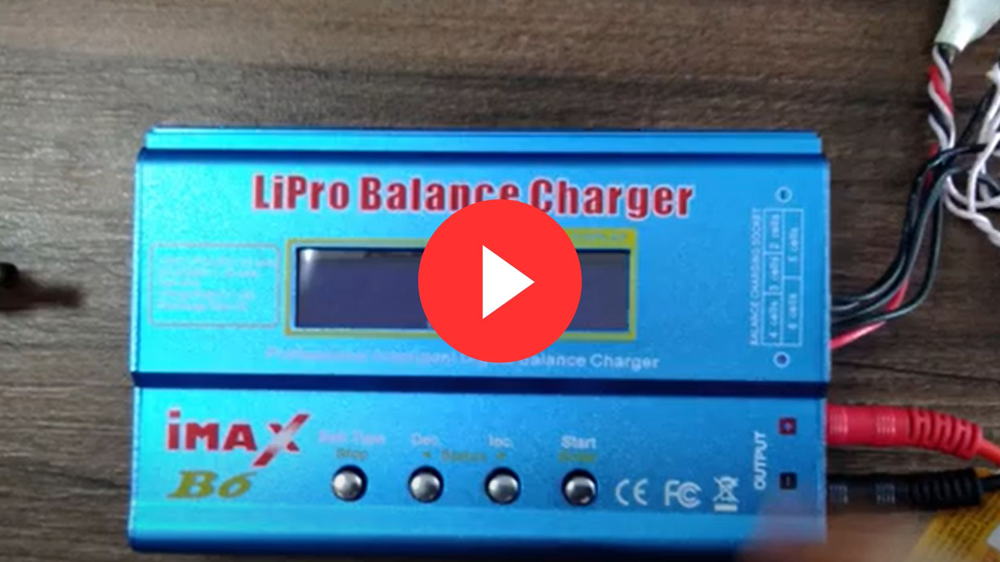](https://youtu.be/bVaBa6dQdzk)

