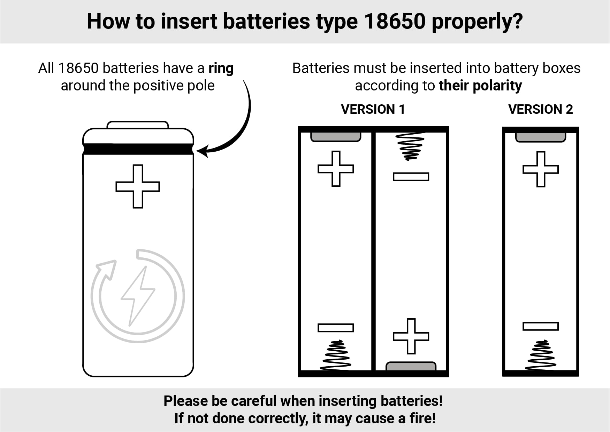

# All-about-batteries
Here you will find everything about batteries

# 18650 Battery Usage and Recommendations

This document provides essential information for the safe handling, installation, and selection of 18650 lithium-ion batteries. It includes details on battery dimensions, installation procedures, and recommended models with their specifications.

## 1. Battery Dimensions

18650 batteries typically have the following dimensions:
* **Diameter:** `18mm`
* **Length:** `65mm`

## 2. How to Insert the Battery

Follow these steps carefully to insert the battery:

### ➤ Step 1: Determine Polarity
Identify the positive (`+`) and negative (`-`) poles of the contact pads.

### ➤ Step 2: Inspect the Battery for Damage
Before installation, visually inspect the battery for any signs of damage.  
**Contraindications for use:**
* Presence of dents on the battery body.
* Damage to the insulation, especially near the positive pad.

### ➤ Step 3: Install the Battery
Install the battery into the holder, ensuring you observe the correct polarity (`+` into `+`, `-` into `-`).

## 3. Recommended Battery Models

The following table lists recommended 18650 battery models with their typical current and capacity specifications.

| Manufacturer | Model         | Current (A) | Capacity (mAh) |
| :----------- | :------------ | :---------- | :------------- |
| Molicel      | INR18650-P28A | `35`        | `2800`         |
| Molicel      | INR18650-P26A | `35`        | `2600`         |
| Murata       | VTC5D         | `35`        | `2800`         |
| Murata       | VTC5A         | `30-35`     | `2500`         |
| Samsung      | INR18650-25S  | `25-35`     | `2500`         |
| Samsung      | INR18650-20S  | `30`        | `2000`         |
| Murata       | VTC6          | `30`        | `2100`         |
| Murata       | VTC5          | `20-30`     | `2600`         |
| Sanyo        | UR18650NSX    | `20`        | `2500`         |
| Samsung      | INR18650HG2   | `20`        | `3000`         |
| Samsung      | INR18650HJ2   | `20`        | `3000`         |
| Samsung      | INR18650HE4   | `20`        | `2500`         |
| Samsung      | INR18650-25R  | `20`        | `2500`         |

## 4. Battery Specifications and Purchase Guidelines

### Size
* Flat-top batteries are recommended, but not strictly required.
* Ensure the battery is **exactly `65 mm` long**. Some batteries may be `2-3 mm` longer, which will prevent them from fitting into the holders.

### Characteristics
* **Voltage:** `3.7 Volts`
* **Current:** The rated current must be **not less than `10 Amperes`**. This parameter is the most crucial for performance and safety. Avoid buying batteries designed for flashlights, especially if the current rating is not explicitly indicated on the packaging.
* **Recommended Capacity:** `2500-3800 mAh`.  
  Be cautious: if you see capacities advertised as `4000-9000 mAh`, consider that this is likely a fake capacity.

# One-Color Corset Battery Requirements and Recommendations

This document provides essential information for selecting, purchasing, and safely using the correct battery for a one-color LED corset from ETERESHOP.

## 1. Battery Specifications

The corset requires a **Li-Pol 3S** battery with the following specifications:

* **Voltage:** `11.1 Volts`
* **Capacity:** *The higher, the longer the dress will work* (e.g., `2200mAh` – `5200mAh`)
* **Connector Type:** `T-plug` (also called **Deans connector** in the USA)

> **Important:** Batteries with a different connector type **will not fit** the corset's socket!

## 2. Where to Buy the Battery

You can purchase these batteries at most local hobby shops (recommended for warranty and assistance) or online from the following links:

* [Voltz 2200mAh 3S 11.1V 30C LiPo Battery – eBay](https://www.ebay.com/itm/Voltz-2200mAh-3S-11-1v-30C-LiPo-Battery/142737322581)
* [HRB 3S LiPo Battery with T-Plug – Amazon](https://www.amazon.com/HRB-Connector-Quadcopter-Helicopter-Airplane/dp/B06XKW4X6F)
* [Zeee 5200mAh 3S 11.1V 50C LiPo – Amazon](https://www.amazon.com/Zeee-5200mAh-50C-11-1V-Compatible/dp/B07CWS1HC5)

## 3. Recommended Chargers

A **LiPo balance charger** is required. The recommended model is:

* **Imax B6 Charger** (but any LiPo-compatible balance charger will work)

Purchase options:

* [Imax B6 Charger – Amazon](https://www.amazon.com/Intelligent-Multifunction-Battery-Balance-Charger/dp/B07HNBQKNK)
* [Simple 11.1V LiPo Charger – Amazon](https://www.amazon.com/Charger-Balance-Discharger-Digital-Batteries/dp/B07V5CPYRS)
* [Hobby Fans Balance Discharger – Amazon](https://www.amazon.com/Hobby-Fans-Professional-Balance-Discharger/dp/B09XC91BWJ)

> **Tip:** Make sure the charger's input voltage matches your local electrical grid.

---

**Note:** Always monitor the charging process for LiPo batteries. Never leave them unattended while charging, and store them in a fireproof container if possible.

